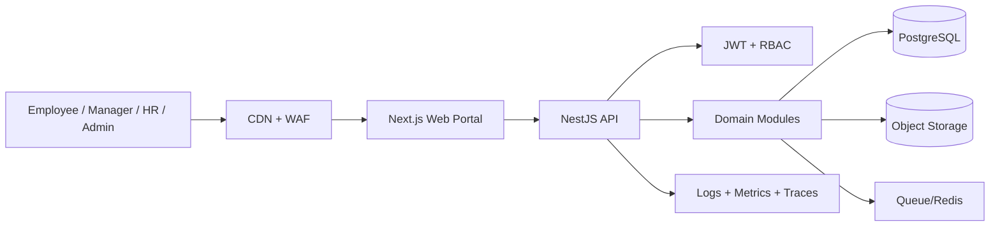

# Architecture

## Modules
- Auth: login, refresh, JWT strategy
- Users: self-profile
- Employees: HR/Admin CRUD
- Attendance: check-in/check-out/history
- Leave: request + status tracking
- Expenses: claim + list
- Tasks: assignment + execution tracking
- Dashboard: role-wise analytics

